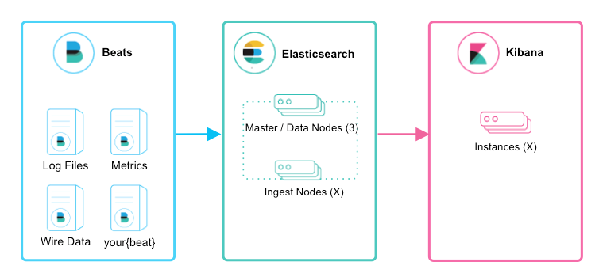

# Aplicación: Elasticsearch

De la descripción del repositorio de GitHub de Elasticsearch: "Elasticsearch es un  motor de búsqueda y analísticas distribuido qué es el corazón de Elastic Stack. Tú puedes usar Elasticsearch para guardar, buscar, y manejar datos...". Este motor es muy usado en aplicaciones de marketing, seguridad, indexación, etc.

 

 La imagen provee una vista básica de la arquitectura de Elastic Stack que emplea Elasticsearch. Se puede ver como los beats se envían los datos hacia Elasticsearch que se encarga de la indexación, procesamiento, correlación de datos. Estos datos son posteriormente enviados a Kibana que se encarga de la visualización de estos datos. 